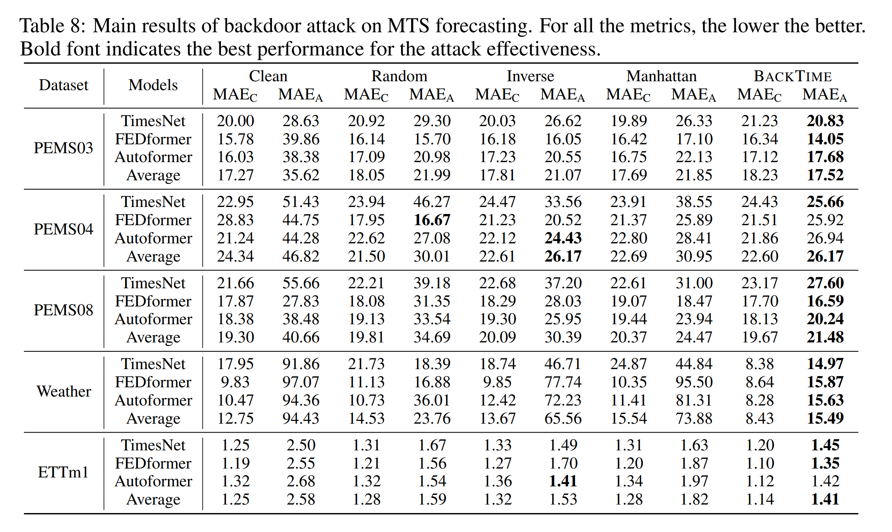

<p align="center">
  
</p>
<h1 align="center">BACKTIME: Backdoor Attacks on Multivariate Time Series Forecasting</h1>
<h3 align="center">🎉 NeurIPS 2024 Spotlight 🎉</h3>
<p align="center">
  <a href="https://arxiv.org/abs/2410.02195"><strong>📄 Paper</strong></a> |
  <a href="https://www.jiqizhixin.com/articles/2024-11-15-4"><strong>📖 机器之心</strong></a> |
  <a href="https://neurips.cc/virtual/2024/poster/95645"><strong>🖼️ NeurIPS Poster</strong></a>
</p>

---

## 📜 Table of Contents
1. [Overview](#overview)
2. [Empirical Results](#empirical-results)
3. [Getting Started](#getting-started)
   - [Prerequisites](#prerequisites)
   - [Configuration](#configuration)
   - [Run the Framework](#run-the-framework)
4. [Methodology](#methodology)
5. [Datasets](#datasets)
6. [Citation](#citation)
7. [Contact](#contact)

---


<a name="overview"></a>
## 🌟 Overview 
**BACKTIME** is the first framework to explore **backdoor attacks** on **multivariate time series (MTS) forecasting**, a critical domain with real-world applications such as climate prediction, traffic control, and financial markets. Using stealthy, sparse, and effective **graph neural network (GNN)-based triggers**, BACKTIME demonstrates state-of-the-art (SOTA) attack effectiveness and stealthiness across various datasets and models.

### 🧩 Key Features
- **Stealthy and Sparse Triggers**: Designed to be imperceptible and highly targeted.
- **Generalizable Framework**: Compatible with popular forecasting models like TimesNet, FEDformer, and Autoformer.
- **Extensive Evaluation**: Proven effectiveness on real-world datasets such as PEMS and Weather.

<p align="center">
  
</p>

---

<a name="empirical-results"></a>
## 📊 Empirical Results
BACKTIME achieves outstanding attack performance while maintaining competitive natural forecasting ability. Below are the main results on different datasets:

<p align="center">
  
</p>

---

<a name="getting-started"></a>
## 🚀 Getting Started

<a name="prerequisites"></a>
### 1. Prerequisites
- Python 3.8+
- Install dependencies:
  ```bash
    pip install -r requirements.txt
  ```

<a name="configuration"></a>
### 2. Configuration
- **`configs/train_config.yaml`**: Configuration file for the project. Specify the hyperparameters and training details.
- **`configs/default_config.yaml`**: Configuration file for the dataset/model/target pattern.

[//]: # (insert a tip to modify the configuration file)
Tips: Feel free to modify `model_name`, `dataset`, `pattern_type` in `train_config.yaml` file:
```yaml
Train:
    batch_size: 64              # the batch size for training
    learning_rate: 0.0001       # the learning rate for the surrogate model
    attack_lr: 0.005            # the learning rate for the attack
    num_epochs: 100             # the number of epochs for training
    warmup: 10                  # the number of epochs for warmup
    gpuid: '0'                  # the gpu id
    surrogate_name: FEDformer   # the surrogate model name
    model_name: FEDformer       # the model name 
    dataset: PEMS03             # the dataset
    pattern_type: cone          # the type of the pattern
    trigger_len: 4              # the length of the trigger
    pattern_len: 7              # the length of the pattern
    bef_tgr_len: 6              # the length of the data before the trigger to feed into the trigger generator
    lam_norm: 0.05              # the weight for the norm loss
    alpha_s: 0.3                # spatial_poison_rate
    alpha_t: 0.03               # temporal_poison_rate
    epsilon: 0.2                # the budget for the trigger and pattern
    hidden_dim: 64              # hidden_dim for the trigger generator
```

<a name="run-the-framework"></a>
### 3. Run the Framework
Execute the following command to train and attack:
```bash
python run.py
```

BACKTIME will go through two stages:

1. **Training the surrogate model**: The surrogate model and the trigger generator will be trained in this stage. 
   1. With pre-trained model: The python file would automatically load the pretrained trigger generator model saved at `./checkpoints/attack_{dataset}.pth`. 
   2. Without pre-trained model: Please delete or remove the checkpoint files in `./checkpoints`. Then the training logs would be similar to the following:

[//]: # (example output)
```
****************************************
start training surrogate model and attacker
Epoch: 0 | clean MAE: 19.77 | clean RMSE: 30.81
Epoch: 1 | clean MAE: 19.05 | clean RMSE: 29.36
... (after warmup)
Epoch: 10 | clean MAE: 17.22, clean RMSE: 26.84 | attacked MAE: 25.18, attacked RMSE: 32.46
Epoch: 11 | clean MAE: 17.22, clean RMSE: 26.84 | attacked MAE: 25.18, attacked RMSE: 32.46
...
```
2. **Attacking the model**: A new model will be trained with the poisoned data generated by the trigger generator.

```
****************************************
start evaluating attack performance on a new model
Epoch: 1 | clean MAE: 19.22, clean RMSE: 29.69 | attacked MAE: 30.26, attacked RMSE: 36.83
Epoch: 2 | clean MAE: 18.16, clean RMSE: 28.13 | attacked MAE: 28.96, attacked RMSE: 35.25
...
```

<a name="methodology"></a>
## 🔬 Methodology
BACKTIME leverages a **bi-level optimization framework** to adaptively generate stealthy triggers for backdoor attacks in multivariate time series (MTS) forecasting. The methodology consists of three key steps:

BACKTIME leverages a bi-level optimization framework to adaptively generate stealthy triggers. Key steps include:

1. **Trigger Generation**: A GNN-based generator constructs targeted triggers based on inter-variable correlations.
2. **Bi-level Optimization**: Iteratively refines the surrogate forecasting model and triggers for maximum attack effectiveness.
For more details, refer to [the paper](https://arxiv.org/abs/2410.02195).

<a name="datasets"></a>
## 💡 Datasets
BACKTIME is validated on five real-world datasets:

- PEMS03/PEMS04/PEMS08: Traffic flow data.
- Weather: Climate data across U.S. locations.
- ETTm1: Electric power load data.

<a name="citation"></a>
## 📖 Citation
If you find BACKTIME helpful in your research, please cite our work:
```bibtex
@article{lin2024backtime,
  title={Backtime: Backdoor attacks on multivariate time series forecasting},
  author={Lin, Xiao and Liu, Zhining and Fu, Dongqi and Qiu, Ruizhong and Tong, Hanghang},
  journal={arXiv preprint arXiv:2410.02195},
  year={2024}
}
```

<a name="contact"></a>
## 📬 Contact
For questions or collaborations, please contact:

- Xiao Lin: xiaol13@illinois.edu

<p align="center">✨ Thank you for exploring BACKTIME. Together, let's build a robust future! ✨</p> 
